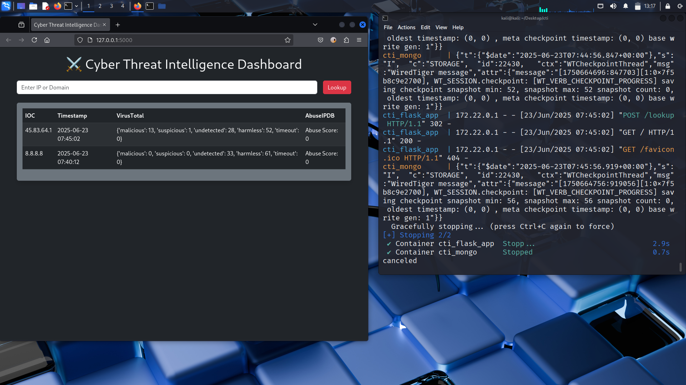

# ⚔️ Cyber Threat Intelligence Dashboard


> A Dockerized Cyber Threat Intelligence platform — lookup IPs and domains against VirusTotal and AbuseIPDB in real time, persist results in MongoDB, and visualize threat data in a Bootstrap dark-theme dashboard.

---

## Overview

Cyber Threat Intelligence Dashboard is a full-stack threat lookup platform that combines two industry-standard threat intelligence APIs into a single unified interface. Submit any IP address or domain and get instant cross-referenced threat data — VirusTotal engine analysis scores and AbuseIPDB confidence ratings — all persisted to MongoDB for historical tracking.

The entire stack runs in Docker with a single command — Flask app + MongoDB, no manual setup needed.

---

## Screenshot



*Live lookup — `45.83.64.1` flagged as malicious: 13 engines on VirusTotal. `8.8.8.8` (Google DNS) showing clean with Abuse Score: 0.*

---

## Architecture

```
┌──────────────────────────────────────────────────────────────┐
│           CYBER THREAT INTELLIGENCE DASHBOARD                │
├──────────────────────────────────────────────────────────────┤
│                                                              │
│  ┌────────────────────────────────────────────────────────┐  │
│  │        FLASK APP (app/__init__.py + routes.py)        │  │
│  │                                                        │  │
│  │   GET  /        → load IOC history from MongoDB       │  │
│  │   POST /lookup  → query APIs → store → redirect       │  │
│  └────────────────────────────────────────────────────────┘  │
│                            │                                 │
│            ┌───────────────┴───────────────┐                │
│            ▼                               ▼                │
│  ┌──────────────────────┐      ┌──────────────────────────┐ │
│  │  VIRUSTOTAL API      │      │  ABUSEIPDB API           │ │
│  │  apis/virustotal.py  │      │  apis/abuseipdb.py       │ │
│  │                      │      │                          │ │
│  │  /v3/search?query=   │      │  /v2/check?ip=           │ │
│  │  x-apikey header     │      │  maxAgeInDays: 90        │ │
│  │  Returns engine      │      │  Returns abuse           │ │
│  │  analysis stats      │      │  confidence score        │ │
│  └──────────────────────┘      └──────────────────────────┘ │
│                            │                                 │
│                            ▼                                 │
│  ┌────────────────────────────────────────────────────────┐  │
│  │              MONGODB (flask-pymongo)                  │  │
│  │   Database: cti_dashboard                             │  │
│  │   Collection: iocs                                    │  │
│  │   Fields: ioc, timestamp, virustotal, abuseipdb       │  │
│  │   Sorted by timestamp descending                      │  │
│  └────────────────────────────────────────────────────────┘  │
│                            │                                 │
│                            ▼                                 │
│  ┌────────────────────────────────────────────────────────┐  │
│  │     BOOTSTRAP DARK DASHBOARD (dashboard.html)         │  │
│  │   IOC table: IOC | Timestamp | VirusTotal | AbuseIPDB │  │
│  │   Real-time lookup form                               │  │
│  └────────────────────────────────────────────────────────┘  │
│                                                              │
│  ┌──────────────────────────────────────────────────────┐    │
│  │              DOCKER COMPOSE                          │    │
│  │   cti_flask_app  →  port 5000                        │    │
│  │   cti_mongo      →  port 27017 + persistent volume   │    │
│  └──────────────────────────────────────────────────────┘    │
└──────────────────────────────────────────────────────────────┘
```

---

## Features

### 🔍 IOC Lookup
- Enter any IP address or domain
- Simultaneously queries VirusTotal and AbuseIPDB
- Results displayed instantly in the dashboard table
- Every lookup persisted to MongoDB with UTC timestamp

### 🦠 VirusTotal Integration
- Uses VirusTotal API v3 `/search` endpoint
- Returns full `last_analysis_stats`:
  - `malicious` — engines that flagged as malicious
  - `suspicious` — engines flagging as suspicious
  - `undetected` — clean engines
  - `harmless` — engines confirming clean
  - `timeout` — engines that timed out
- API key loaded from environment variable `VT_API_KEY`

### 🚨 AbuseIPDB Integration
- Uses AbuseIPDB API v2 `/check` endpoint
- 90-day lookback window
- Returns `abuseConfidenceScore` (0-100%)
- API key loaded from environment variable `ABUSEIPDB_API_KEY`

### 🗄️ MongoDB Persistence
- All lookups stored in `cti_dashboard.iocs` collection
- Historical IOC table sorted newest-first
- Persistent Docker volume — data survives container restarts

### 🐳 Docker-First Deployment
- Single `docker compose up` starts everything
- Flask app + MongoDB containerized together
- Environment variables via `.env` file
- No manual MongoDB installation needed

---

## Project Structure

```
CyberThreat-Intelligence/
│
├── app/
│   ├── __init__.py           # Flask app factory + MongoDB init
│   ├── routes.py             # Blueprint routes — index + lookup
│   ├── apis/
│   │   ├── virustotal.py     # VirusTotal API v3 integration
│   │   └── abuseipdb.py      # AbuseIPDB API v2 integration
│   └── templates/
│       └── dashboard.html    # Bootstrap 5 dark-theme dashboard
│
├── Dockerfile                # Flask app container
├── docker-compose.yml        # Flask + MongoDB orchestration
├── run.py                    # Entry point (host 0.0.0.0 for Docker)
├── requirements.txt          # Python dependencies
├── CTI.png                   # Dashboard screenshot
└── CTI_Report.docx           # Sample CTI report
```

---

## Tech Stack

| Component | Technology | Version |
|-----------|-----------|---------|
| Backend | Python, Flask | 2.3.2 |
| Database | MongoDB | 4.4 |
| ODM | flask-pymongo | 2.3.0 |
| HTTP Client | requests | 2.31.0 |
| Config | python-dotenv | 1.0.1 |
| Frontend | Bootstrap 5 dark theme | 5.3.0 |
| Containerization | Docker, Docker Compose | 3.8 |
| Threat Intel | VirusTotal API v3 | — |
| Threat Intel | AbuseIPDB API v2 | — |

---

## Installation

### Prerequisites
- Docker + Docker Compose installed
- VirusTotal API key ([get free key](https://www.virustotal.com/gui/join-us))
- AbuseIPDB API key ([get free key](https://www.abuseipdb.com/register))

### Setup

**Clone the repository:**
```bash
git clone https://github.com/Ki1shan/CyberThreat-Intelligence.git
cd CyberThreat-Intelligence
```

**Create `.env` file:**
```bash
VT_API_KEY=your_virustotal_api_key_here
ABUSEIPDB_API_KEY=your_abuseipdb_api_key_here
FLASK_SECRET_KEY=your_secret_key_here
```

**Start the stack:**
```bash
docker compose up --build
```

**Open in browser:**
```
http://127.0.0.1:5000
```

---

## Usage

1. Open `http://127.0.0.1:5000`
2. Enter an IP address or domain in the lookup field
3. Click **Lookup**
4. View results in the IOC table:

| IOC | Timestamp | VirusTotal | AbuseIPDB |
|-----|-----------|-----------|----------|
| 45.83.64.1 | 2025-06-23 07:45:02 | malicious: 13, suspicious: 1 | Abuse Score: 0 |
| 8.8.8.8 | 2025-06-23 07:40:12 | malicious: 0, harmless: 61 | Abuse Score: 0 |

---

## Sample API Responses

**VirusTotal — malicious IP:**
```json
{
  "last_analysis_stats": {
    "malicious": 13,
    "suspicious": 1,
    "undetected": 28,
    "harmless": 52,
    "timeout": 0
  }
}
```

**AbuseIPDB — clean IP:**
```json
{
  "data": {
    "abuseConfidenceScore": 0,
    "totalReports": 0,
    "lastReportedAt": null
  }
}
```

---

## Environment Variables

| Variable | Description |
|----------|-------------|
| `VT_API_KEY` | VirusTotal API v3 key |
| `ABUSEIPDB_API_KEY` | AbuseIPDB API v2 key |
| `FLASK_SECRET_KEY` | Flask session secret |
| `MONGO_URI` | MongoDB connection string (default: `mongodb://mongo:27017/cti_dashboard`) |

---

## Author

**Kishan N**
Offensive Security Engineer | Threat Intelligence | Blue Team

Built Cyber Threat Intelligence Dashboard to demonstrate real-world CTI workflows — aggregating multi-source threat data into a persistent, queryable platform with a clean analyst-friendly interface.

---

## License

MIT License — see `LICENSE` file for details.

---

*Know your threats before they know you.*
